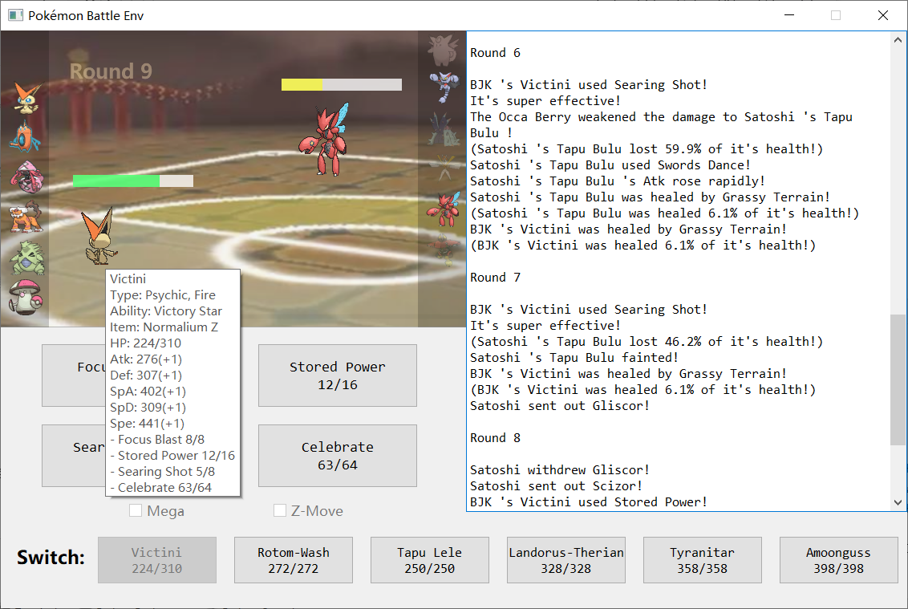

# Pokemon_Battle_Env

## About it

It's an alpha version of Pokemon Gen7 6v6 battle env, implementing most mechanism of OU and UU tier.

It provides both human-vs-AI battle GUI for playing, and AI-vs-AI automatic battle for training.

More features will continue to be updated, and any reports of bugs and unimplemented mechanisms are always welcome!

Thanks to Pokemon Showdown for providing pokemon and move data.\
Thanks to BJK for providing battle teams.

## How to use?

For GUI:
Run `ui.py`, and battle with the built-in AI!

For non-GUI:
Run `game.py`, and built-in AI will automatically perform a battle!

Note:Change the player class in `Game.py` to switch between the two modes!

## How to create my own AI?

1. Create your own player class by inheriting Player class in `player.py`,
2. Implement abstract methods in your class according to your strategy,
3. Import your own team into 'team' directory, and edit according parameters in your class (Of course you can just use
   built-in teams!).

GUI Example

Battle Log Example

The game between Satoshi and BJK started!\
Satoshi's pokemons: Garchomp/Landorus-Therian/Tapu Fini/Heatran/Amoonguss/Weavile\
BJK's pokemons: Pelipper/Kingdra/Crawdaunt/Magearna/Araquanid/Swampert\

Satoshi sent out Landorus-Therian!\
BJK sent out Crawdaunt!\
[Satoshi 's Landorus-Therian 's intimidate]\
BJK 's Crawdaunt 's Atk fell!

Round 1\
BJK 's Crawdaunt used Aqua Jet!\
It's super effective!\
(Satoshi 's Landorus-Therian lost 67.5% of it's health!)\
Satoshi 's Landorus-Therian used U-turn!\
It's super effective!\
(BJK 's Crawdaunt lost 80.5% of it's health!)\
Satoshi withdrew Landorus-Therian!\
Satoshi sent out Tapu Fini!\
[Satoshi 's Tapu Fini 's Misty Surge]\
Mist swirled around the battlefield!

Round 2\
BJK 's Crawdaunt used Aqua Jet!\
It's not very effective...\
(Satoshi 's Tapu Fini lost 13.9% of it's health!)\
Satoshi 's Tapu Fini used Taunt!\
BJK 's Crawdaunt was taunted!\
Satoshi 's Tapu Fini restored HP with Leftovers.\
(Satoshi 's Tapu Fini was healed 6.1% of it's health!)

Round 3\
BJK 's Crawdaunt used Aqua Jet!\
It's not very effective...\
(Satoshi 's Tapu Fini lost 14.2% of it's health!)\
Satoshi 's Tapu Fini used Taunt!\
BJK 's Crawdaunt is already taunted!\
Satoshi 's Tapu Fini restored HP with Leftovers.\
(Satoshi 's Tapu Fini was healed 6.1% of it's health!)

Round 4\
BJK 's Crawdaunt used Aqua Jet!\
It's not very effective...\
(Satoshi 's Tapu Fini lost 13.9% of it's health!)\
Satoshi 's Tapu Fini used Taunt!\
BJK 's Crawdaunt is already taunted!\
BJK 's Crawdaunt 's taunt ended!\
Satoshi 's Tapu Fini restored HP with Leftovers.\
(Satoshi 's Tapu Fini was healed 6.1% of it's health!)

Round 5\
BJK 's Crawdaunt used Aqua Jet!\
It's not very effective...\
(Satoshi 's Tapu Fini lost 13.9% of it's health!)\
Satoshi 's Tapu Fini used Taunt!\
BJK 's Crawdaunt was taunted!\
Satoshi 's Tapu Fini restored HP with Leftovers.\
(Satoshi 's Tapu Fini was healed 6.1% of it's health!)\
The mist disappeared from the battlefield.

Round 6\
BJK withdrew Crawdaunt!\
BJK sent out Kingdra!\
Satoshi 's Tapu Fini used Hydro Pump!\
BJK 's Kingdra avoided the attack!\
Satoshi 's Tapu Fini restored HP with Leftovers.\
(Satoshi 's Tapu Fini was healed 6.1% of it's health!)

Round 7\
BJK withdrew Kingdra!\
BJK sent out Araquanid!\
Satoshi 's Tapu Fini used Taunt!\
BJK 's Araquanid was taunted!\
Satoshi 's Tapu Fini restored HP with Leftovers.\
(Satoshi 's Tapu Fini was healed 6.1% of it's health!)

Round 8\
BJK withdrew Araquanid!\
BJK sent out Magearna!\
Satoshi 's Tapu Fini used Hydro Pump!\
(BJK 's Magearna lost 28.8% of it's health!)\
Satoshi 's Tapu Fini restored HP with Leftovers.\
(Satoshi 's Tapu Fini was healed 6.1% of it's health!)

Round 9\
Satoshi 's Tapu Fini used Hydro Pump!\
BJK 's Magearna avoided the attack!\
BJK 's Magearna used Ice Beam!\
It's not very effective...\
(Satoshi 's Tapu Fini lost 8.4% of it's health!)\
Satoshi 's Tapu Fini restored HP with Leftovers.\
(Satoshi 's Tapu Fini was healed 6.1% of it's health!)

Round 10\
Satoshi 's Tapu Fini used Nature's Madness!\
(BJK 's Magearna lost 35.4% of it's health!)\
BJK 's Magearna used Trick Room!\
It twisted the dimensions!\
Satoshi 's Tapu Fini restored HP with Leftovers.\
(Satoshi 's Tapu Fini was healed 6.1% of it's health!)

Round 11\
BJK 's Magearna used Fleur Cannon!\
Satoshi 's Tapu Fini avoided the attack!\
Satoshi 's Tapu Fini used Defog!\
BJK 's Magearna 's Evasion fell!\
Satoshi 's Tapu Fini restored HP with Leftovers.\
(Satoshi 's Tapu Fini was healed 6.1% of it's health!)

Round 12\
BJK 's Magearna used Fleur Cannon!\
A critical hit!\
(Satoshi 's Tapu Fini lost 62.3% of it's health!)\
BJK 's Magearna 's Sp. Atk fell harshly!\
Satoshi 's Tapu Fini used Defog!\
BJK 's Magearna 's Evasion fell!\
Satoshi 's Tapu Fini restored HP with Leftovers.\
(Satoshi 's Tapu Fini was healed 6.1% of it's health!)

Round 13\
BJK 's Magearna used Ice Beam!\
It's not very effective...\
(Satoshi 's Tapu Fini lost 4.2% of it's health!)\
Satoshi 's Tapu Fini used Hydro Pump!\
(BJK 's Magearna lost 31.2% of it's health!)\
(BJK 's Magearna used Iapapa Berry!)\
(BJK 's Magearna was healed 33.3% of it's health!)\
Satoshi 's Tapu Fini restored HP with Leftovers.\
(Satoshi 's Tapu Fini was healed 6.1% of it's health!)

Round 14\
Satoshi 's Tapu Fini used Defog!\
BJK 's Magearna 's Evasion fell!\
BJK 's Magearna used Trick Room!\
The twisted dimensions returned to normal!\
Satoshi 's Tapu Fini restored HP with Leftovers.\
(Satoshi 's Tapu Fini was healed 6.1% of it's health!)

Round 15\
Satoshi 's Tapu Fini used Nature's Madness!\
(BJK 's Magearna lost 18.9% of it's health!)\
BJK 's Magearna used Ice Beam!\
It's not very effective...\
(Satoshi 's Tapu Fini lost 4.2% of it's health!)\
Satoshi 's Tapu Fini restored HP with Leftovers.\
(Satoshi 's Tapu Fini was healed 6.1% of it's health!)

Round 16\
Satoshi 's Tapu Fini used Nature's Madness!\
(BJK 's Magearna lost 9.3% of it's health!)\
BJK 's Magearna used Volt Switch!\
It's super effective!\
A critical hit!\
(Satoshi 's Tapu Fini lost 21.3% of it's health!)\
BJK withdrew Magearna!\
BJK sent out Pelipper!\
[BJK 's Pelipper 's Drizzle]\
It started to rain!\
Satoshi 's Tapu Fini restored HP with Leftovers.\
(Satoshi 's Tapu Fini was healed 6.1% of it's health!)\
Rain continues to fall.

Round 17\
Satoshi 's Tapu Fini used Defog!\
BJK 's Pelipper 's Evasion fell!\
BJK 's Pelipper used Scald!\
It's not very effective...\
(Satoshi 's Tapu Fini lost 13.9% of it's health!)\
Satoshi 's Tapu Fini restored HP with Leftovers.\
(Satoshi 's Tapu Fini was healed 6.1% of it's health!)\
Rain continues to fall.

Round 18\
Satoshi 's Tapu Fini used Taunt!\
BJK 's Pelipper was taunted!\
BJK 's Pelipper used U-turn!\
It's not very effective...\
(Satoshi 's Tapu Fini lost 3.5% of it's health!)\
BJK withdrew Pelipper!\
BJK sent out Magearna!\
Satoshi 's Tapu Fini restored HP with Leftovers.\
(Satoshi 's Tapu Fini was healed 6.1% of it's health!)\
Rain continues to fall.

Round 19\
Satoshi withdrew Tapu Fini!\
Satoshi sent out Weavile!\
[Satoshi 's Weavile 's Pressure]\
Satoshi 's Weavile is exerting pressure!\
BJK withdrew Magearna!\
BJK sent out Pelipper!\
[BJK 's Pelipper 's Drizzle]\
Rain continues to fall.

Round 20\
Satoshi 's Weavile used Knock Off!\
(BJK 's Pelipper lost 50.3% of it's health!)\
BJK 's Pelipper used Defog!\
Satoshi 's Weavile 's Evasion fell!\
Rain continues to fall.

Round 21\
Satoshi 's Weavile used Icicle Crash!\
(BJK 's Pelipper lost 42.8% of it's health!)\
BJK 's Pelipper used Defog!\
Satoshi 's Weavile 's Evasion fell!\
Rain continues to fall.

Round 22\
Satoshi 's Weavile was surrounded by Z-Power!\
Satoshi 's Weavile used Subzero Slammer!\
(BJK 's Pelipper lost 6.8% of it's health!)\
BJK 's Pelipper fainted!\
Rain continues to fall.\
BJK sent out Kingdra!

Round 23\
BJK 's Kingdra used Hydro Pump!\
(Satoshi 's Weavile lost 100.0% of it's health!)\
Satoshi 's Weavile fainted!\
The rain stopped.\
Satoshi sent out Heatran!

Round 24\
BJK withdrew Kingdra!\
BJK sent out Araquanid!\
Satoshi 's Heatran used Earth Power!\
It's not very effective...\
(BJK 's Araquanid lost 10.1% of it's health!)

Round 25\
Satoshi 's Heatran used Earth Power!\
It's not very effective...\
(BJK 's Araquanid lost 10.4% of it's health!)\
BJK 's Araquanid used Liquidation!\
It's super effective!\
(Satoshi 's Heatran lost 100.0% of it's health!)\
Satoshi 's Heatran fainted!\
Satoshi sent out Amoonguss!

Round 26\
BJK 's Araquanid used Liquidation!\
It's not very effective...\
(Satoshi 's Amoonguss lost 50.0% of it's health!)\
Satoshi 's Amoonguss used Giga Drain!\
(BJK 's Araquanid lost 19.5% of it's health!)\
(Satoshi 's Amoonguss was healed 7.5% of it's health!)\
Satoshi 's Amoonguss restored HP with Black Sludge.\
(Satoshi 's Amoonguss was healed 6.0% of it's health!)

Round 27\
BJK 's Araquanid used Liquidation!\
It's not very effective...\
A critical hit!\
(Satoshi 's Amoonguss lost 63.6% of it's health!)\
Satoshi 's Amoonguss fainted!\
Satoshi sent out Tapu Fini!\
[Satoshi 's Tapu Fini 's Misty Surge]\
Mist swirled around the battlefield!

Round 28\
Satoshi withdrew Tapu Fini!\
Satoshi sent out Landorus-Therian!\
[Satoshi 's Landorus-Therian 's intimidate]\
BJK 's Araquanid 's Atk fell!\
BJK 's Araquanid used Liquidation!\
It's super effective!\
(Satoshi 's Landorus-Therian lost 32.5% of it's health!)\
Satoshi 's Landorus-Therian fainted!\
Satoshi sent out Tapu Fini!\
[Satoshi 's Tapu Fini 's Misty Surge]

Round 29\
Satoshi 's Tapu Fini used Defog!\
BJK 's Araquanid 's Evasion fell!\
BJK 's Araquanid used Liquidation!\
It's not very effective...\
(Satoshi 's Tapu Fini lost 30.6% of it's health!)\
Satoshi 's Tapu Fini fainted!\
Satoshi sent out Garchomp!

Round 30\
Satoshi 's Garchomp evolved into Garchomp-Mega!\
Satoshi 's Garchomp-Mega used Stone Edge!\
It's super effective!\
(BJK 's Araquanid lost 60.1% of it's health!)\
BJK 's Araquanid fainted!\
BJK sent out Magearna!

Round 31\
Satoshi 's Garchomp-Mega used Swords Dance!\
Satoshi 's Garchomp-Mega 's Atk rose rapidly!\
BJK 's Magearna used Trick Room!\
It twisted the dimensions!

Round 32\
Satoshi 's Garchomp-Mega used Earthquake!\
It's super effective!\
(BJK 's Magearna lost 9.6% of it's health!)\
BJK 's Magearna fainted!\
The mist disappeared from the battlefield.\
BJK sent out Crawdaunt!

Round 33\
BJK 's Crawdaunt used Crunch!\
(Satoshi 's Garchomp-Mega lost 86.2% of it's health!)\
Satoshi 's Garchomp-Mega used Stone Edge!\
(BJK 's Crawdaunt lost 19.5% of it's health!)\
BJK 's Crawdaunt fainted!\
BJK sent out Swampert!

Round 34\
BJK withdrew Swampert!\
BJK sent out Kingdra!\
Satoshi 's Garchomp-Mega used Stealth Rock!\
Pointed stone floated on BJK 's field.

Round 35\
BJK 's Kingdra used Hydro Pump!\
(Satoshi 's Garchomp-Mega lost 13.8% of it's health!)\
Satoshi 's Garchomp-Mega fainted!\
Satoshi lost!

Update Log

2022.4.30

【Add】\
Base physical/special moves\
Spikes (add and effect)

【Todo】\
✔defog \
✔rapid spin\
✔leech seed\
✔knock off\ ✔status moves fail after taunt\
✔contrary\
✔counter\
✔mirror coat\
✔U-turn\
✔volt switch

2022.5.1

【Add】\
weather, ability & stop\
terrain, ability & stop\    
terrain seeds\
pressure\
pp\
protect\
hidden power\
unburden\
use item\
acrobatics\
rocky helmet & rough skin\
beast boost\
soul heart\
air balloon \
focus sash

【Todo】\
✔download \
✔anticipation\
✔unnerve\
✔intimidate\
✔frisk\
✔trace\
✔silvally\
✔arceus\
✔match-up switch-\
is to ==

2022.5.2

【Add】\
Justified\
Steadfast\
Fake Out\
First Impression

【Todo】\
✔Trick\
✔Sucker Punch\
✔Pain Split\
✔Choice Items

【ToFix】\
✔Faint over and over!

2022.5.3

【Todo】\
✔Own Tempo\
✔Vital Spirit\
✔Healing Wish\
✔Synthesis\
✔Water Bubble\
✔Skill Link

2022.5.4

【Add】\
Mega

【Todo】\
✔Roost\
✔Z-move\
✔Ability log in utils\
✔Berry\
✔struggle\
Ditto

2022.5.5

【Add】\
heal bell\
vstatus\
black sludge\
magic guard\
confusion hit self\
Infiltrator\
light screen reflect\
confusion hit\
brick break wall\
nightmare

【Todo】\
Gravity [immue judge]\
sleep talk

2022.5.6

【Add】\
all gen7 ou abilities\
water shuriken ash\
mega seq

【Todo】\
破格时机

2022.5.7

【Add】\
Prankster\
natural cure

【Todo】\
✔wish\
✔roar\
✔change move type before effecting\
✔z move not effected by skin

【ToFix】\
Wrong struggle

2022.5.8

【Add】\
Arceus Z Inner Focus\
moxie\
magician, pickpocket\
heatproof\
gooey\
insomnia\
weak armor\
rock head\
heavy/light metal\
Poison Touch\
Shield dust\
oblivious\
Illusion\
Emergency Exit

【ToFix】\
✔Partiallytrapped\
✔mind blown\
✔damp

2022.5.9

【Add】\
Arranged code

【Todo】\
Natural Gift\
Soak etc.

2022.5.11

【Todo】\
embargo log

【ToFix】\
subsitute judge->whether damaged dealt to true body

2022.5.13

【Todo】\
Cloud Nine

